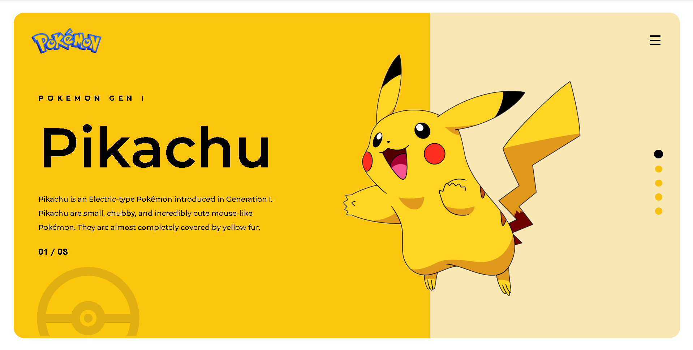

# The Unofficial Pokémon Page
A responsive, highly visual UI card showcasing Pikachu from Generation I.

## 🚀 Overview
This is a frontend web development project focused on creating a clean, scalable user interface. The entire layout is designed to maintain its aspect ratio across different screen sizes using viewport-based units (vmin).

## 🛠️ Technologies Used
- HTML5: Semantic structuring

- CSS3: Flexbox, Absolute Positioning, Viewport Units

- External Assets: Google Fonts (Montserrat), Remix Icons

## 💡 Key Learnings
- Utilizing vmin to lock layout proportions and ensure extreme responsiveness.

- Layering visual elements using z-index and absolute positioning.

- Integrating base64 images and external icon libraries to enhance visual appeal.

## 📸 The Unofficial Pokémon Page

**🟢 Live Demo:** )

A responsive, highly visual UI card showcasing Pikachu from Generation I...
